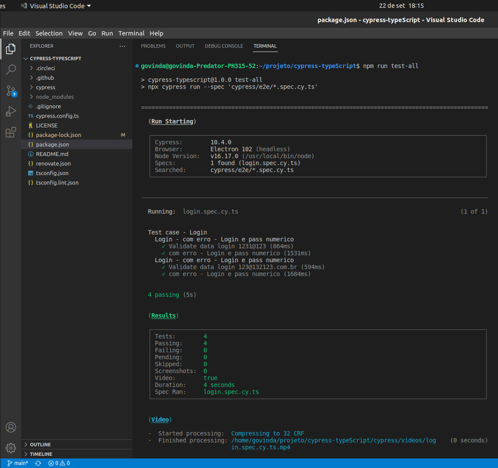
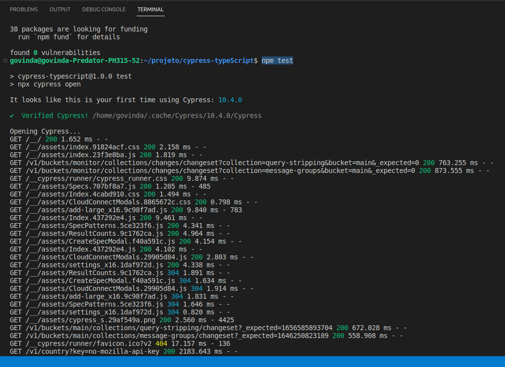
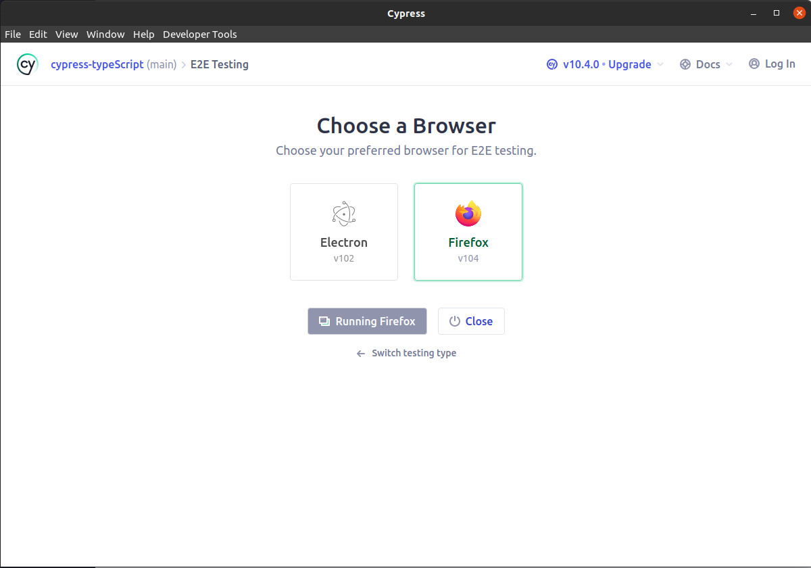
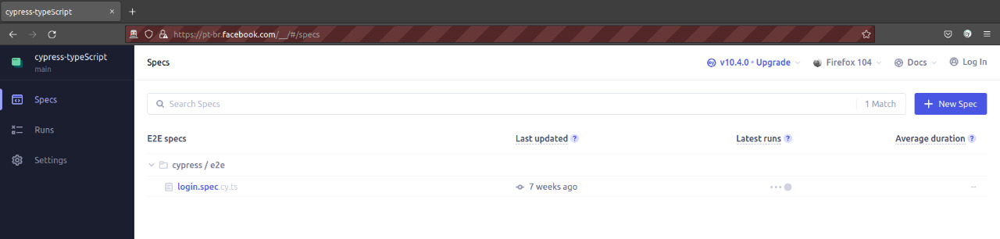
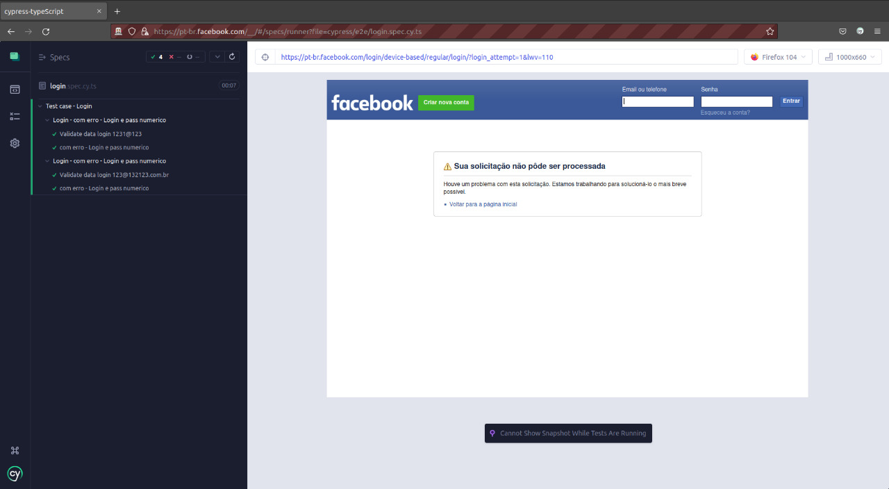

# Cypress-Typescript

Objetivo : Automação do sistema de backoffice

## Como instalar

```cmd

npm install

```


## Como executar todos os testes


```cmd

npm run test-all

```



## Como testar pela UI


```cmd

npm test

```







## Liks

https://www.cypress.io/